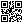

<!--
SPDX-FileCopyrightText: 2021 Robin Vobruba <hoijui.quaero@gmail.com>

SPDX-License-Identifier: CC0-1.0
-->

# KiCad image/QR-Code integrator

[](
https://www.gnu.org/licenses/gpl-3.0.txt)
[](
https://api.reuse.software/info/github.com/hoijui/kicad-image-injector)

status: WIP,  tech-demo, alpha

## What is this

A stand-alone (python) tool
to replace rectangular template areas drawn onto a KiCad PCB
with B&W images or QR-Codes.

This was written with the intention to include QR-Codes
containing git-commit specific information
onto a PCB and later the generated Gerber & Drill files
in a CI job.

## What it does

pseudo code (python):

```python
pcb = parseKicadPcb("some_board.kicad_pcb")
placeholders = scanForPlaceholderRectangles(pcb)
for p_holder in placeholders:
    if referencesImage(p_holder):
       pixels = loadImagePixels(p_holder.imagePath)
    elif referencesQrData(p_holder):
       pixels = generateQrCode(p_holder.data)
    pcb.replace(p_holder, pixels)
pcb.writeKicadPcb("some_board-REPLACED.kicad_pcb")
```

## Usage

1. You design your PCB in KiCad
    and include rectangular areas on any silk or copper layer.
    Remember how many rectangles you created!

2. Make sure the images you want to inject are available (e.g. generate them).

3. run this tool with the appropriate number of arguments
    (image paths or qr-code data strings).
    In the case of two placeholder rectangles, it could be:

    ```bash
    python3 placeholder2image.py ~/some/path/board.kicad_pcb qr.png 'qr:My Data'
    ```

4. do what you want with the generated PCB:
   `~/some/path/board-REPLACED.kicad_pcb`

Run `python3 placeholder2image.py --help` for more info.

## Example

input:


(generated with: `qrencode -s 1 -m 1 -o qr.png "My Data"`)

[](https://github.com/hoijui/for-science-keyboar/base.kicad_pcb)

output:


